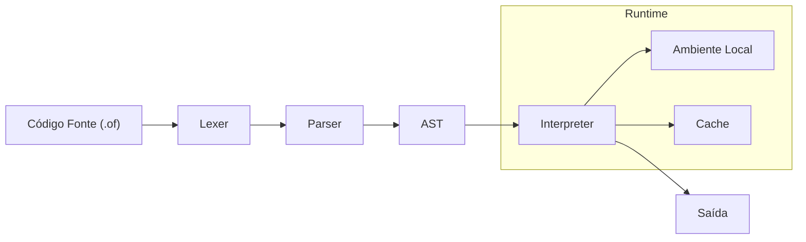

# 🩸🐑 Old Faith


> **Um projeto educacional de design de compiladores com temática inspirada em "Cult of the Lamb".**

**Old Faith** é uma linguagem de programação interpretada desenvolvida em **Julia**, criada para estudar a implementação de um *frontend* de compilador (Lexer, Parser, AST) e um interpretador tree-walk.

A linguagem utiliza uma "skin" temática baseada no jogo **Cult of the Lamb**, onde conceitos técnicos de computação são mapeados para a lore do jogo para tornar o aprendizado mais engajante e memorável.

## 🎯 Objetivos Educacionais

O projeto explora como **decisões de compilador** (como otimização e segurança) podem ser controladas explicitamente pelo programador através de metadados (anotações), em vez de serem "mágicas" implícitas do compilador.

| Feature Técnica | Conceito Temático | Descrição |
| :--- | :--- | :--- |
| **Memoization Explícita** | `@shamura` | O sistema armazena resultados de chamadas de função (cache) para evitar recomputação. Transforma complexidade exponencial em linear. |
| **Pure Functions / Sandbox** | `@kallamar` | Garante que a função não tenha efeitos colaterais e não acesse escopo global, permitindo execução segura. |
| **Execution Budget** | `@heket` | *Planejado*. Limita o tempo de execução ou número de instruções para evitar loops infinitos. |
| **Paralelismo/Threads** | `@leshy` | *Planejado*. O código cresce desordenadamente em várias direções (threads) para execução paralela. |
| **Async/Await** | `@narinder` | *Planejado*. "Aquele Que Espera" pausa a execução até a promessa ser cumprida (concorrência assíncrona). |

## 🔮 Roadmap Futuro

* **v0.2** - Profecias em Texto (Strings e IO)
* **v0.3** - `@kallamar` - Sandbox puro
* **v0.4** - `@leshy` - Implementação de Threads e Paralelismo
* **v0.5** - `@narinder` - Suporte a operações Async/Await
* **v0.6** - `@heket` - Controle de Budget de execução

## 🏗️ Pipeline do Compilador

O fluxo de execução segue a arquitetura clássica de interpretação:



## 🚀 Como Executar

### Requisitos

* **Julia** (versão 1.6 ou superior)

### Instalação

```bash
git clone https://github.com/EduLoboM/R-Core
cd OldFaith
```

### Exemplo de Uso (Benchmark)

Para demonstrar a funcionalidade de memoização (`@shamura`), incluímos um benchmark usando a sequência de Tribonacci.

1.  Execute o arquivo de teste:
    ```bash
    julia tests/benchmark_prophecy.jl
    ```

2.  Exemplo de Código (`.of`):
    ```julia
    # A anotação @shamura ativa o cache (memoization)
    @shamura
    rite prophecy(n) {
        # 'rite' é uma função, 'sacrifice' é o retorno
        n < 3 ? sacrifice 1 : sacrifice prophecy(n-1) + prophecy(n-2) + prophecy(n-3);
    }
    ```

## 📚 Estrutura do Projeto

* `src/ast.jl`: Definição das estruturas da Árvore Sintática (RiteDef, Expressions).
* `src/lexer.jl`: Análise léxica e definição de tokens.
* `src/parser.jl`: Parser descendente recursivo.
* `src/interpreter.jl`: Lógica de execução, gerenciamento de memória e cache.

---

<p align="center">
Desenvolvido para fins de estudo com 💖 por<b>Eduardo Lôbo Moreira</b>.
<br>
<i>Inspirado pela estética de Massive Monster's Cult of the Lamb.</i>
</p>