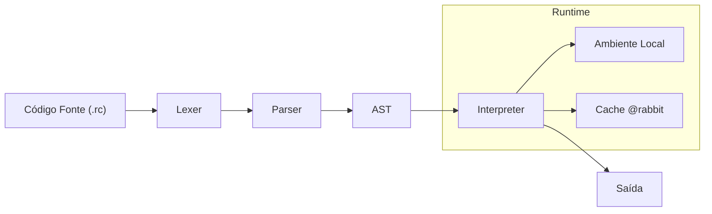

# 🐇🦏🦌 R-Core


> **Uma linguagem de programação interpretada voltada ao estudo de design de compiladores, controle explícito de otimizações em tempo de execução e restrições funcionais via metadados.**

**R-Core** é um projeto educacional desenvolvido em **Julia**, focado na implementação de um *frontend completo de compilador* (Lexer, Parser e AST) integrado a um **interpretador determinístico**.
O objetivo é explorar como **decisões de otimização, segurança e orçamento** podem ser delegadas ao programador/pesquisador por meio de **anotações explícitas simples**, mantendo o runtime simples, previsível e controlável.

## 🚀 Principais Features

R-Core foi projetada para ser minimalista na sintaxe, mas profunda nos conceitos.

| Feature                                 | Descrição                                                                                                                                                                    | Status                 |
| --------------------------------------- | ---------------------------------------------------------------------------------------------------------------------------------------------------------------------------- | ---------------------- |
| **`@rabbit` — Memoization Explícita**   | Sistema de **memoization automática** controlado por anotação. Converte algoritmos recursivos exponenciais (ex.: Tribonacci) em execução linear usando cache no runtime.     | ✅ Implementada         |
| **`@rhino` — Funções Puras**            | Impõe **pureza funcional**, proibindo efeitos colaterais, acesso global e mutações externas. Funciona como sandbox semântico.                                                | 🛠️ Em Desenvolvimento |
| **`@reindeer` — Orçamento de Execução** | Anotação que define **limites explícitos de execução** (tempo ou repetições), permitindo **resultados aproximados ou melhor-esforço** sob regras determinísticas do runtime. | 🧭 Planejada           |
| **Arquitetura Modular**                 | Uso extensivo de **Multiple Dispatch (Julia)** para separar AST, ambiente e execução, facilitando extensões futuras.                                                         | ✅ Implementada         |
| **Parser Recursive Descent**            | Parser escrito manualmente, respeitando precedência matemática e associatividade, sem uso de ferramentas geradoras. Ideal para estudo de compiladores.                       | ✅ Implementada         |

## 🏗️ Pipeline de Execução

O fluxo de execução da R-Core segue um modelo clássico de frontend de compilador integrado a um interpretador:



## 🚅 Quick Start

### Requisitos

* **Julia** (versão estável mais recente)

### Instalação

```bash
git clone https://github.com/EduLoboM/R-Core
cd R-Core
```

### Executando um Benchmark

O exemplo de uso da R-Core é o **Tribonacci recursivo**, demonstrando o impacto da anotação `@rabbit`:

```bash
julia tests/tribonacci.jl
```

**Saída final esperada:**

```bash
--- 3. Interpreter ---
  Iniciando cálculo de trib(30) com @rabbit ativado...
  Cronometrando...
  0.251128 seconds (722.61 k allocations: 34.837 MiB, 3.08% gc time, 99.86% compilation time)

  >> RESULTADO FINAL: 37895489
```

## 👾 Exemplo de Código

A sintaxe da R-Core é inspirada em linguagens imperativas clássicas, com extensões semânticas via atributos:

```julia
@rabbit
func trib(n) {
    return n < 3
        ? 1
        : trib(n-1) + trib(n-2) + trib(n-3);
}
```

A anotação `@rabbit` instrui o interpretador a **memorizar chamadas recursivas**, eliminando recomputações redundantes automaticamente.

## 📚 Documentação Técnica

A documentação detalha cada estágio do interpretador:

1. [**Lexer**](documentation/lexer.md) — Tokenização e classificação léxica.
2. [**Parser**](documentation/parser.md) — Construção da AST com precedência correta.
3. [**AST**](documentation/ast.md) — Estrutura formal dos nós sintáticos.
4. [**Interpreter**](documentation/interpreter.md) — Avaliação, escopo, ambiente e cache.
5. [**LeanCeption**](documentation/architecture/LeanCeption.md) — Estudo do projeto e seus requisitos mínimos.
6. [**Design**](documentation/architecture/Design.md) — Estudo da composição de camadas semânticas e design.


## 🗺️ Roadmap

* **v0.2**

  * Suporte a strings
  * Entrada e saída básica
  * Mensagens de erro mais amigáveis

* **v0.3**

  * Implementação completa de `@rhino`
  * Verificar se uma função `@rhino` tenta acessar variáveis globais
  * Avisar quando `@rabbit` é usado em funções impuras

* **v0.4**

  * Introdução da anotação `@reindeer`
  * Estratégias avançadas de execução controlada
  * Gerar bytecode ou transpilar para Julia nativo
  * Um terminal interativo para rodar comandos linha a linha

---

<p align="center">
Made with 💖 by <b>Eduardo Lôbo Moreira</b>
</p>