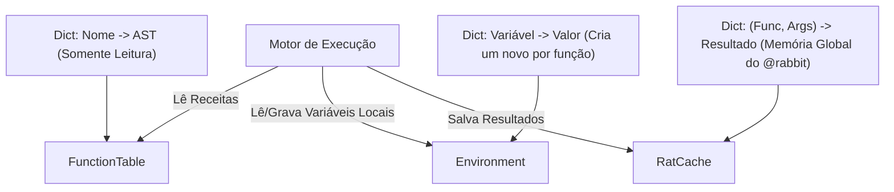
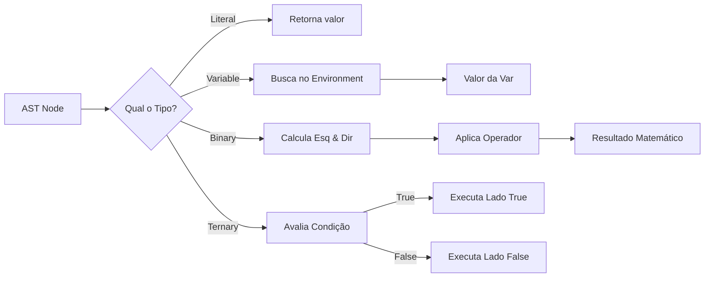
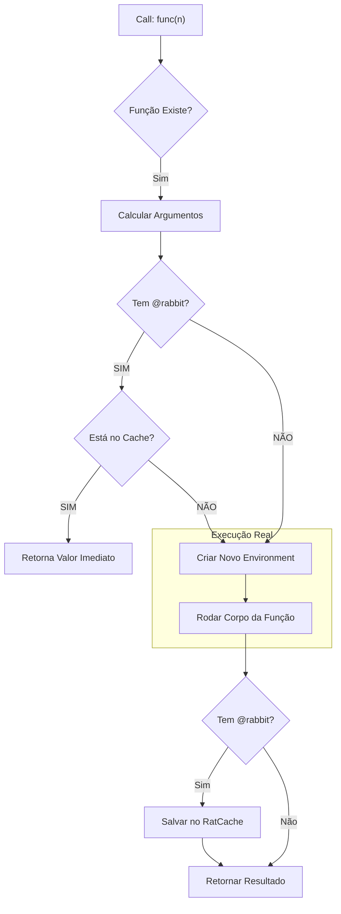

O Interpretador percorre a árvore AST gerada pelo Parser e executa as instruções. Ele usa o sistema de Multiple Dispatch do Julia para trabbitar cada tipo de nó (Literal, Binary, Call) de forma diferente.

Gráfico 1: Arquitetura de memória

Gráfico 2: Ciclo do evaluate (multiple dispatch)

gráfico 3: Lógica do @rabbit