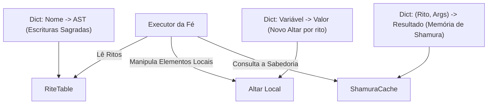
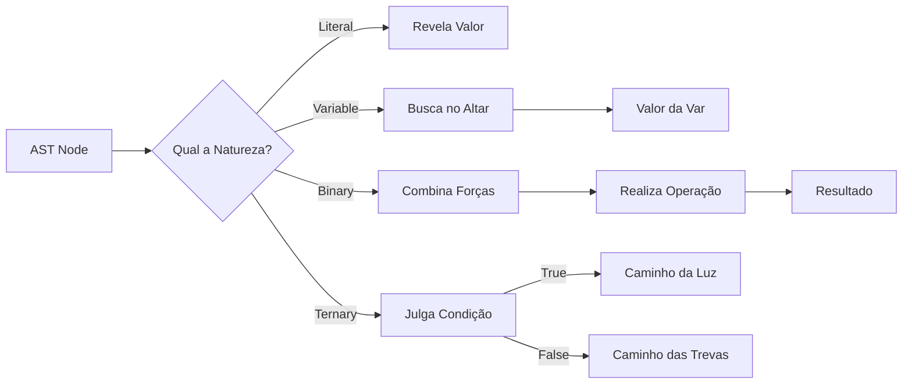
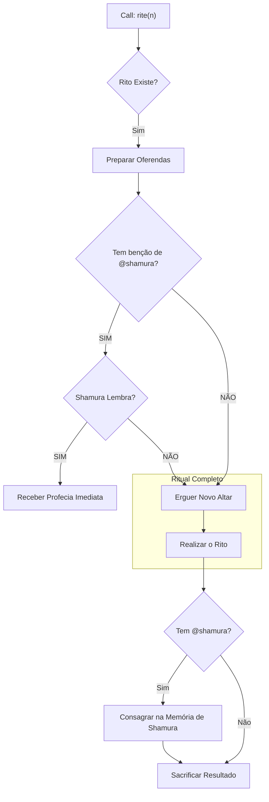

O Interpretador percorre a árvore sagrada (AST) e executa a vontade dos Bispos. Ele usa o sistema de Multiple Dispatch do Julia para tratar cada tipo de oferenda (Literal, Binary, Call) de forma apropriada.

Gráfico 1: Arquitetura da Fé

Gráfico 2: Ciclo de Avaliação

Gráfico 3: Lógica de @shamura