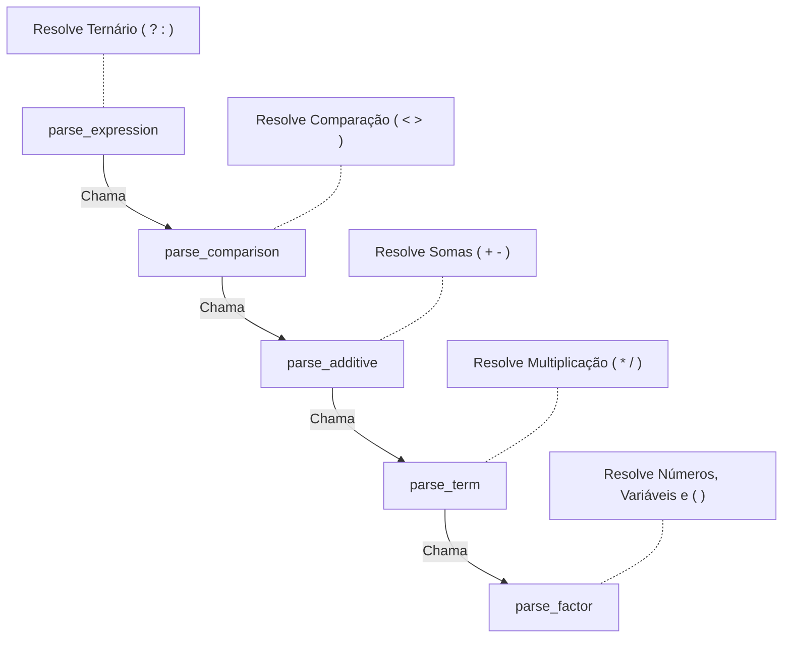
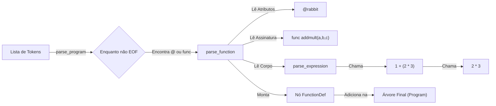

Gráfico 1: Síntese da lógica do parser.jl

Daqui pra frente para melhor explicar a lógica desse programa vamos udar de exemplo a função @rabbit addmult(a, b, c) que tem a tag @rabbit e retorna os valores de a + b * c


Gráfico 2: como o programa interpreta addmult(1, 2, 3)

```mermaid
graph TD

    %% 1. A Raiz (A Função)
    Func[FunctionDef: addmult]:::root

    %% 2. O Atributo (A GRANDE MUDANÇA)
    %% Visualmente, é uma etiqueta ligada à definição
    TagRabbit[@rabbit]:::attr
    Func --> TagRabbit

    %% 3. Metadados normais
    Params[Params: a, b, c]:::meta
    Func --> Params

    %% 4. O Corpo (Idêntico ao anterior)
    RootPlus[BinaryExpression: +]:::op
    Func --> RootPlus

    %% 5. A Matemática
    VarA(Variable: a):::var
    RootPlus --> VarA

    SubMult[BinaryExpression: *]:::op
    RootPlus --> SubMult

    VarB(Variable: b):::var
    VarC(Variable: c):::var
    SubMult --> VarB
    SubMult --> VarC
```
Gráfico 3: como fica a árvore final de addmult(a, b, c)

